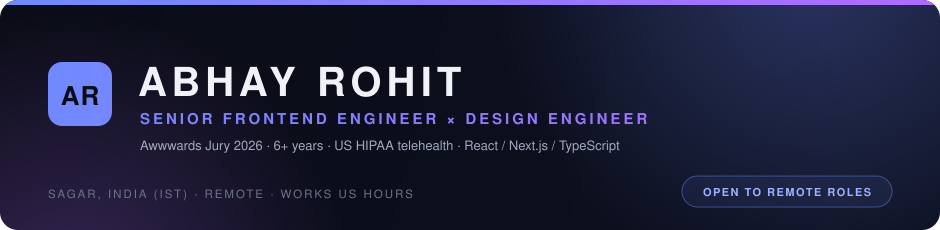

## What I build

- **Regulated product ecosystems** — ~3.7 years as the sole frontend engineer of a US HIPAA-compliant telehealth platform: patient commerce, clinic booking, clinician & patient portals, CMS and Java/Spring APIs.
- **Payments that don't drop orders** — Stripe saved cards, PayPal subscriptions, Square, fail-safe retry confirmation.
- **High-craft interactive web** — GSAP, Three.js/WebGL, Canvas and Lottie; agency work recognized by Orpetron, CSS Design Awards and CSS Winner.
- **Quality infrastructure** — Playwright + Cucumber end-to-end suites, Sentry observability, CI/CD, AWS.

## Selected work

| Project | What it is |
| --- | --- |
| **US telehealth platform** | 5 production apps · 3,716 commits · 626 merged PRs — private employer repositories |
| **[Khajuraho Expo](https://khajuraho.haspr.in)** | 3D WebGL virtual tour of the UNESCO World Heritage temples — 10-language audio guides, gyroscope navigation |
| **[haspr.in](https://haspr.in)** | Award-recognized agency portfolio — designed and built end to end |
| **[haspr-cursor](https://www.npmjs.com/package/haspr-cursor)** | Published npm package powering the site's custom cursor and motion system |

## Toolbox

**Frontend** — React · Next.js · TypeScript · Sass&ensp;·&ensp;**Motion / 3D** — GSAP · Three.js · WebGL · Canvas · Lottie&ensp;·&ensp;**Quality** — Playwright · Cucumber · Sentry&ensp;·&ensp;**Platform** — Java / Spring Boot · Node.js · PostgreSQL · Strapi · Docker · AWS&ensp;·&ensp;**Design** — Figma · design systems&ensp;·&ensp;**AI workflow** — coding agents · reusable skills · structured automation

## Elsewhere

**[abhayrohit.com](https://abhayrohit.com)** · [LinkedIn](https://www.linkedin.com/in/abhayrohit) · [Awwwards jury profile](https://www.awwwards.com/jury-member/abhay-rohit) · [Behance](https://www.behance.net/haspr) · [Dribbble](https://dribbble.com/haspr)

**Open to remote senior frontend / product / design-engineering roles (US hours friendly)** — hello@abhayrohit.com

 

Designed & hand-cut in SVG — this profile is a work sample.

